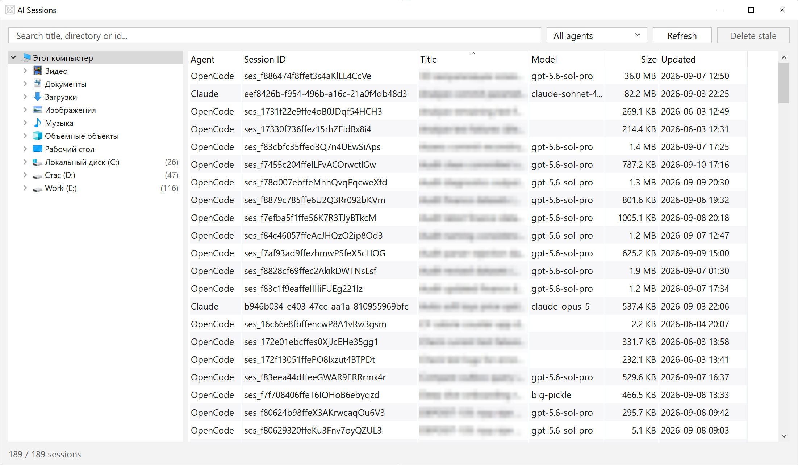

# AI Sessions

Browser for Claude Code and OpenCode session history. Pure Win32 / C++20, no
runtime dependencies — a single self-contained `aisessions.exe`.



Rows select the Explorer way — click, Ctrl+click, Shift+click, Ctrl+A — and a
click on a column header sorts by it; a second click flips the direction. The
sort survives a restart, and the selection survives a re-sort or a narrower
filter.

The toolbar has **Refresh** and **Delete stale**. Delete stale removes every
Claude session in the *current view* whose transcript has been pruned — the
dimmed, unresumable ones — in a single rewrite of `history.jsonl`, and reports
how much space it freed. It is disabled when the view holds none, so the folder
tree and the search box scope what it cleans up. Because it is view-scoped, an
accidental click cannot reach beyond what is on screen.

Right-click a row (or press the menu key on the focused one) for actions that
apply to the whole selection:

* **Copy session ID** (also `Ctrl+C`) — puts the ids on the clipboard, one per
  line; the status line confirms it.
* **Resume in terminal** (also `Ctrl+Enter`) — opens a Windows Terminal tab per selected session, in
  its directory, running `claude --resume <id>` or `opencode --session <id>`. A
  directory that no longer exists falls back to the user profile; more than
  three tabs at once is confirmed first.

  Two details matter here. The agent runs as the tab's own process under the
  user's **default profile**, read from Windows Terminal's `settings.json`:
  given a bare command line Windows Terminal drops back to a plain console look,
  and wrapping the agent in a shell opened a Command Prompt tab instead — either
  way the session came up in the wrong colours. And the child inherits a cleaned
  environment: Claude Code marks everything it spawns with
  `CLAUDE_CODE_CHILD_SESSION` and friends, and a session resumed with those
  still set believes it is a nested child and **turns transcript saving off**,
  so it would never be recorded and would disappear from this list.
* **Delete session** (also the Del key) — asks once for the whole selection,
  listing what goes, then removes each. OpenCode
  goes through `opencode session delete`, the vendor's own command, which keeps
  the database consistent even while opencode is running. Claude has no such
  command, so its transcript is moved to the **Recycle Bin** and its entries are
  dropped from `history.jsonl`, which is rewritten atomically with the previous
  file kept as `history.jsonl.bak`.

## Sources

| Agent    | Where it reads from |
|----------|---------------------|
| Claude   | `%USERPROFILE%\.claude\history.jsonl`, with AI titles from `%USERPROFILE%\.claude\projects\**\*.jsonl` |
| OpenCode | `%LOCALAPPDATA%\share\opencode\opencode.db`, falling back to `%USERPROFILE%\.local\share\opencode\opencode.db` |

The project transcripts run to hundreds of megabytes, so they are scanned in
1 MB blocks and lines are rejected on a substring test before any JSON parsing.

## UI

* Left pane is the shell's own navigation control (`CLSID_NamespaceTreeControl`)
  — the same one Explorer uses, so drives, folders and icons look identical.
  Selecting a folder filters the list to sessions at or below it.
* Each folder shows, right-aligned and dimmed, the number of sessions at or
  under it — a plain `unordered_map<path, count>` built from every session's
  directory and all of its ancestors in one pass, so the number is already
  "at or under this folder" with no per-item recursion when the tree paints.
  Drawn via `INameSpaceTreeControlCustomDraw`, discovered by the control
  through `QueryInterface` on the same object passed to `TreeAdvise` — there
  is no separate registration call for it. A folder with no sessions is left
  exactly as Explorer would show it.
* Expanding is driven from `INameSpaceTreeControlEvents::OnItemClick` rather
  than by a control style: a click on a label or icon opens a folder and never
  closes it, while a click on the expando toggles it and leaves the selection
  alone — matching the navigation pane. The control reports the hit reliably
  but does not act on it, so both gestures are applied explicitly.
* The search box, the agent list and the button draw their own chrome. Left to
  the system they came out three different heights — a drop-down list ignores
  the height it is given and shrinks to one derived from its item height — and
  the shaded combo and button looked dated beside an Explorer-themed list. They
  now share one flat frame, one height taken from the font, and hover, pressed
  and focus states in both palettes.
* Theme follows the Windows app mode. `AISESSIONS_THEME=dark|light` overrides it.
* `AISESSIONS_TRACE=<file>` logs the shell control's callbacks. Those callbacks
  are the only visible evidence of what a gesture did, and they fire for real
  input only — a posted `WM_LBUTTONDOWN` never raises `OnItemClick`.
* The Size column is the transcript file for Claude and the sum of the message
  and part rows for OpenCode, in bytes; sorting compares the number, not the
  label. Claude's Model is the last one an assistant message in the transcript
  was produced with. Both show "—" for a Claude session whose transcript is
  gone: Claude Code prunes transcripts after `cleanupPeriodDays` (30 by
  default), and such a session cannot be resumed either — only its history
  line survives. Those rows are drawn dimmed, Resume is greyed out for them
  (and skips them in a mixed selection), and Ctrl+Enter says so in the status
  line instead of launching into an error.
* Window geometry, column widths and the sort persist to
  `%LOCALAPPDATA%\AISessions\settings.json`. Widths are in 96-dpi units so a
  saved layout survives moving between monitors of different scaling, and every
  entry is keyed by the column's name rather than its index, so reordering
  columns in the code cannot silently hand a width or the sort to a different
  column.

## Build

Requires the MSVC toolchain and CMake.

```
cmake -S . -B build
cmake --build build
```

Produces `build\aisessions.exe` and `build\probe.exe`.

## probe.exe

Development tool that drives a running window from outside for testing. It
never raises the window — actions go through window messages and screenshots
use `PrintWindow` — so a test run does not interrupt whatever is in front.

```
probe [--pid N] list                  enumerate the window and its controls
probe [--pid N] count | status        list item count / status line
probe [--pid N] search <text>         type into the search box
probe [--pid N] agent <index>         pick an entry in the agent combo
probe [--pid N] refresh               press Refresh
probe [--pid N] click <class> <x> <y> click inside a child control
probe [--pid N] hover <class> <x> <y> set the hot item
probe [--pid N] treecount | treestate  node count / expanded+selected per row
probe [--pid N] treeclick <row> [chevron|label]
                                      real mouse click on a tree row, with the
                                      position derived from the item height
probe [--pid N] realclick <class> <x> <y> [ctrl|shift]
probe [--pid N] rightclick <class> <x> <y>
probe [--pid N] selcount              number of selected rows
probe [--pid N] key <down|up|left|right|enter|esc|del>...
probe [--pid N] popup [file.png]      report/capture an open context menu
probe [--pid N] combo                 item count, selection, dropped state
probe [--pid N] move <x> <y> <w> <h>  reposition the window
probe [--pid N] restore | minimize
probe [--pid N] clip [set <text>]     read or overwrite the clipboard
probe [--pid N] shot <file.png>       capture the window
```

Note that `LVM_*` / `TVM_*` messages take pointers and cannot be sent across a
process boundary — doing so faults inside comctl32 in the target. Only
pointer-free messages (`WM_LBUTTONDOWN`, `WM_CHAR`, `WM_COMMAND`, and the tree
queries that pass `HTREEITEM`s by value) are used, and clicks are posted rather
than sent, because a tree view's button-down handler runs a nested loop waiting
for the button-up.

To exercise deleting without touching real sessions, point the app at a throwaway
home: `USERPROFILE` and `LOCALAPPDATA` are all it reads.

`realclick`, `rightclick`, `treeclick` and `key` are the exceptions: they drive the physical pointer and keyboard,
because the shell tree raises its COM events for genuine input only. They take
the foreground for a moment and put the cursor back afterwards, and they fail
loudly if the window could not be brought forward, since a click that lands in
another window would otherwise read as the app ignoring it.
